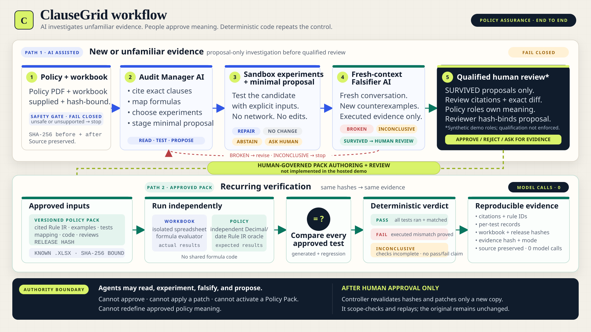
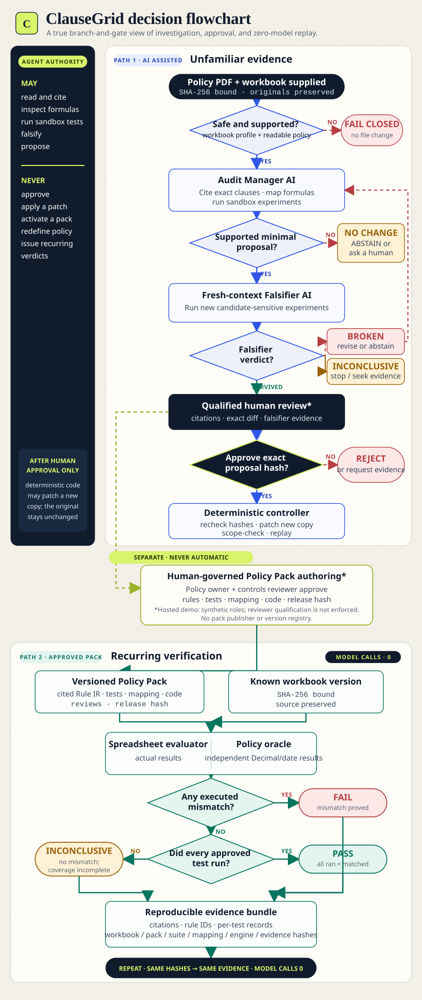

# ClauseGrid

ClauseGrid checks whether the formulas in an Excel workbook follow the rules written in a policy
document.

For example, a supplier contract may say that a waiver removes one penalty but does not remove
another. The spreadsheet can contain a valid-looking formula that ignores this detail and pays the
wrong amount. Normal spreadsheet tools may not notice because the formula is valid Excel.
ClauseGrid tests what the formula **means**, not only whether it can run.

Try the public demonstration at [clausegrid.onrender.com](https://clausegrid.onrender.com).

## Why it exists

Important business rules are often split across two places:

- a PDF explains thresholds, exceptions, dates, caps, and rounding rules;
- an Excel workbook turns those rules into money or decisions.

A small difference between the PDF and the formula can cause an overpayment, underpayment, or
incorrect approval. Reviewing this by hand is slow, difficult to repeat, and easy to get wrong.

ClauseGrid gives finance, procurement, operations, compliance, and audit teams a repeatable way to
check the workbook against an approved interpretation of the policy.

## How ClauseGrid works

ClauseGrid is designed around the workflow below. This repository includes one pre-reviewed
synthetic example. The public demo can replay that approved pack, but it does not provide an
authenticated system for creating approvals or publishing replacement versions.



[Edit the Mermaid workflow source](docs/assets/clausegrid-workflow.mmd).

Implementation basis: [workflow and result contract](#how-clausegrid-works),
[architecture and authority boundary](docs/ARCHITECTURE.md),
[submission checkpoint](docs/SUBMISSION_REPORT.md#model-agent-implementation-checkpoint), and
[representative M10 agent evidence](artifacts/submission/agent-m10/README.md).

1. **Read the policy.** ClauseGrid keeps the exact policy clauses and page references that matter.
2. **Describe expected behaviour.** Thresholds, exceptions, dates, caps, and rounding are turned
   into clear examples and executable rules.
3. **Record human approval.** In a production workflow, a policy owner and a controls reviewer
   approve the same Policy Pack. The demo pack contains synthetic review records for these roles.
4. **Freeze that version.** The rules, tests, workbook mapping, and code versions receive one
   tamper-evident hash.
5. **Test workbooks repeatedly.** Known workbook templates are checked by deterministic code. The
   same inputs and hashes produce the same evidence, with zero model calls.
6. **Keep new edge cases.** A production version registry should turn a new mistake into a
   regression test or a reviewed replacement Policy Pack. The public demo explains this process but
   does not save these changes.

### Decision flowchart

The flowchart below makes the stop conditions, falsifier loop, human approval gate, and recurring
`PASS` / `FAIL` / `INCONCLUSIVE` branches explicit.



[Edit the Mermaid flowchart source](docs/assets/clausegrid-flowchart.mmd).

### What is a Policy Pack?

A Policy Pack is the approved definition of correct behaviour for one policy and workbook type. It
contains:

- the policy rules and their source citations;
- examples around important boundaries and exceptions;
- regression tests for mistakes found in the past;
- the workbook cells that contain inputs and outputs;
- the versions of the deterministic verification code;
- the review records and release hash.

The repository currently includes one complete synthetic Policy Pack for supplier rebates and SLA
penalties. It is a focused demonstration, not a ready-made policy for every company.

## Where AI agents are used

ClauseGrid has an optional AI-assisted investigation path for a new policy, an unfamiliar workbook,
or a suspected formula error.

- The **audit manager agent** chooses which policy pages, workbook cells, dependency checks, and
  sandbox experiments to use. It can propose an explanation or repair.
- The **falsifier agent** starts with fresh context and tries to disprove that proposal using new
  counterexamples.
- Deterministic code checks file safety, runs formulas, compares results, validates hashes, and
  controls whether a proposal is eligible for human review.

The AI agents can help investigate, but they do not decide what the company policy means. They
cannot activate a Policy Pack or silently change a workbook. People approve policy meaning, and
deterministic code owns recurring `PASS`, `FAIL`, or `INCONCLUSIVE` results.

This is the main difference between ClauseGrid and uploading the same files to a general AI chat:
the approved meaning and tests are retained and replayed instead of being interpreted again in every
new conversation.

## Quick start without an API key

The deterministic Policy Pack commands do not need an AI model or API key.

### Requirements

- Git.
- Python 3.11 or newer.
- Internet access during installation so Python can download dependencies.
- PowerShell for the Windows helper scripts. It is already included with modern Windows.

Node.js, Microsoft Excel, Docker, and an API key are **not** required for the first test.

### 1. Download the project

```text
git clone https://github.com/mohakmalviya/ClauseGrid.git
cd ClauseGrid
```

The repository is private during judging, so the GitHub account cloning it must have access. The
uploaded submission ZIP contains the same source tree and does not require GitHub access.

### 2A. Install on Windows

Open PowerShell inside the project folder and run:

```powershell
powershell -ExecutionPolicy Bypass -File .\scripts\setup.ps1
```

The script creates `.venv`, installs the locked dependencies, and installs the `clausegrid` command.

Activate the environment before using the commands below:

```powershell
.\.venv\Scripts\Activate.ps1
```

Run the same activation command whenever you open a new PowerShell window.

If script activation is blocked, allow it only for the current window:

```powershell
Set-ExecutionPolicy -Scope Process Bypass
.\.venv\Scripts\Activate.ps1
```

### 2B. Install on macOS or Linux

Open a terminal inside the project folder and run:

```bash
python3 -m venv .venv
source .venv/bin/activate
python -m pip install --upgrade pip
python -m pip install -e '.[dev]'
```

To activate the environment in a later terminal:

```bash
source .venv/bin/activate
```

### 3. Confirm the installation

After activation, this command should show the available commands:

```text
clausegrid --help
```

### 4. Run the zero-model demonstration

Show the approved Policy Pack:

```text
clausegrid pack-status
```

Check a correct workbook:

```text
clausegrid verify-pack workbooks/reference/supplier_rebate_pristine.xlsx
```

Check a workbook with the waiver-scope defect:

```text
clausegrid verify-pack workbooks/mutants/M10_supplier_rebate.xlsx
```

The first workbook should return `PASS`. M10 should return `FAIL` because one retained regression
test finds the incorrect waiver behaviour. The M10 command intentionally exits with a non-zero code
because a defect was found; this does not mean ClauseGrid crashed.

Both results report `model_calls: 0`.

## Run the website locally with AI investigations

The current web interface contains both the zero-model verifier and the optional AI investigation
area. Starting this combined interface requires one supported model provider and an exact model ID.

### 1. Choose a provider

Set only the key for the provider you want to use:

| Provider option | Environment variable |
|---|---|
| `openai` | `OPENAI_API_KEY` |
| `anthropic` or `claude` | `ANTHROPIC_API_KEY` |
| `deepseek` | `DEEPSEEK_API_KEY` |
| `nvidia-nim` | `NVIDIA_NIM_API_KEY` |
| `qubrid` | `QUBRID_API_KEY` |
| `opencode` | `OPENCODE_API_KEY` |
| `openrouter` | `OPENROUTER_API_KEY` |
| `groq` | `GROQ_API_KEY` |
| `together` | `TOGETHER_API_KEY` |
| `gemini` | `GEMINI_API_KEY` |
| `mistral` | `MISTRAL_API_KEY` |
| `xai` | `XAI_API_KEY` |

API keys must stay in your terminal or deployment secret manager. Never paste a real key into the
README, source code, `.env.example`, a commit, or a screenshot.

Model IDs can change over time. Copy the exact model ID from the provider's current model list. Do
not assume that a model name from another provider will work.

### 2A. Start the site on Windows

This example uses the same Qubrid route configured for the public demo:

```powershell
$env:QUBRID_API_KEY = '<your-key>'
.\.venv\Scripts\clausegrid.exe serve `
  --provider qubrid `
  --model 'deepseek-ai/DeepSeek-V4-Flash' `
  --allow-external-processing
```

### 2B. Start the site on macOS or Linux

```bash
export QUBRID_API_KEY='<your-key>'
clausegrid serve \
  --provider qubrid \
  --model 'deepseek-ai/DeepSeek-V4-Flash' \
  --allow-external-processing
```

Open [http://127.0.0.1:8765](http://127.0.0.1:8765) and leave the terminal running.

The workbench opens in recurring verification mode. Use **Run the M10 quick check** for the
shortest demo, switch to **Investigate new evidence** for the optional agent workflow, or select
**Guided tour** at any time for the seven-step first-user walkthrough.

To use another provider, change all three matching pieces:

1. the environment variable containing its key;
2. the `--provider` value;
3. the exact `--model` value supported by that provider.

For a private OpenAI-compatible gateway, also provide `--base-url` and `--api-key-env`. See
[docs/PROVIDERS.md](docs/PROVIDERS.md) for examples.

### Common setup problems

- **`python` is not recognized on Windows:** install Python 3.11 or newer from python.org, enable
  **Add Python to PATH**, close PowerShell, and open it again.
- **`python3 -m venv` fails on Debian or Ubuntu:** install the operating system's Python venv
  package, commonly `sudo apt install python3-venv`, then create `.venv` again.
- **`clausegrid` is not recognized:** activate `.venv` in the current terminal, then try again.
- **The API key is reported as missing:** export the key in the same terminal that starts ClauseGrid.
  This project does not automatically load a `.env` file.
- **The browser says connection refused:** the `serve` command is not running. Leave that terminal
  open while using the site.
- **Port 8765 is busy:** add `--port 8766` to the `serve` command and open
  `http://127.0.0.1:8766` instead.
- **The provider returns 401:** the key is invalid, expired, or belongs to a different provider.
  Create a new key and update the environment variable; never put it in the repository.

### Why is `--allow-external-processing` required?

The AI agents may send selected formulas, policy text, and experiment results to the chosen model
provider. This flag is an explicit confirmation that you are allowed to send that material outside
your computer. It is required for remote model endpoints.

The deterministic Policy Pack verifier does not call the model, even when the combined website is
running.

## Test your own workbook and policy

In the local website:

1. open **Upload workbook + policy**;
2. choose one `.xlsx` workbook;
3. choose its matching text-readable `.pdf` policy;
4. confirm that the files are approved for processing by the configured model provider;
5. start the AI investigation;
6. review the citations, experiments, falsifier result, and proposed formula change.

ClauseGrid will not compare your workbook against the bundled synthetic policy. Both matching files
are required.

The current safe workbook profile is intentionally narrow. It accepts calculation-focused `.xlsx`
files and rejects macros, external links, Power Query, unsupported volatile formulas, embedded
executables, and other features that the sandbox cannot verify safely. Cross-sheet formula chains
are also limited. See [docs/USER_GUIDE.md](docs/USER_GUIDE.md) for the full supported profile.

Local uploads use an operating-system temporary directory. The original workbook is never modified.
A reviewed repair is written to a new copy.

## Understanding the result

- `PASS` means every approved test ran and matched the Policy Pack.
- `FAIL` means at least one executed test produced a confirmed mismatch.
- `INCONCLUSIVE` means no mismatch was observed, but one or more tests could not run, so ClauseGrid
  does not claim pass or fail.
- `complete: false` means some tests did not run. A result can still be `FAIL` when another executed
  test has already proved a mismatch.
- `ABSTAIN` is used by the AI investigation when the evidence is not strong enough for a proposal.

Important evidence includes the workbook hash, Policy Pack hash, test-suite hash, mapping hash,
individual test records, affected rule IDs, source citations, execution mode, and model-call count.

## Run the automated tests

### Windows

```powershell
.\scripts\verify.ps1
```

### macOS or Linux

With the virtual environment active:

```bash
ruff format --check .
ruff check .
mypy src
pytest
clausegrid eval
```

The current release passed 311 automated tests. Its frozen deterministic benchmark detects all 12
single-formula mutants, preserves all three clean controls, and detects the hard multi-error case.

## Benchmark results

The frozen benchmark contains 12 defective workbooks, three clean controls, one hard case, and 48
sealed test inputs per workbook.

| Workflow | Defects repaired correctly | Clean workbooks preserved | Hard case |
|---|---:|---:|---:|
| Simple deterministic baseline | 33.3% | 100% | 0% |
| Advanced deterministic workflow | **100%** | **100%** | **100%** |

These numbers measure the older deterministic repair workflow. They are **not** performance claims
for the AI agents. Model cost and human time savings have not been measured.

## Deploy with Render

The easiest public deployment uses the included `render.yaml` and Dockerfile.

1. Push the repository to GitHub.
2. In Render, create a new Blueprint from the repository.
3. Keep the Blueprint path as `render.yaml`.
4. Enter the selected provider key in the secret named `CLAUSEGRID_API_KEY`.
5. Confirm that `CLAUSEGRID_PROVIDER` and `CLAUSEGRID_MODEL` match that key.
6. Deploy and wait for `/healthz` to report `ok`.

The included Blueprint currently selects:

```text
CLAUSEGRID_PROVIDER=qubrid
CLAUSEGRID_MODEL=deepseek-ai/DeepSeek-V4-Flash
```

Do not commit `CLAUSEGRID_API_KEY`. Add it only through the Render secret field.

The public service is a demonstration:

- uploads and AI investigations are rate-limited;
- temporary jobs and downloads can disappear after a restart;
- browser-based policy approval is disabled;
- the included approval identities are synthetic demo roles;
- it is not a production multi-tenant compliance system.

Never upload confidential company files to the public demo. Run ClauseGrid locally or in an approved
private environment for real data.

Docker is mainly used to reproduce the hosted environment. A direct local Python installation is
simpler for normal development because public container mode expects an HTTPS origin or reverse
proxy. See [docs/DEPLOYMENT.md](docs/DEPLOYMENT.md) for Docker and production-hardening details.

## Security and privacy rules

- API keys are read from environment variables and are never accepted as command-line values.
- The original workbook is checked by SHA-256 before and after a run and is never edited in place.
- Repairs are copy-on-write and require a separate, hash-bound review step.
- Unsupported workbook features fail closed instead of being guessed.
- The AI agents do not receive an approval or file-apply tool.
- Public responses hide the model provider and model name.
- Real production use still needs authenticated users, durable storage, a version registry, audit
  history, monitoring, retention rules, and an approved provider-data agreement.

## Current limitations

- Only the synthetic supplier-rebate Policy Pack is complete and ready for deterministic replay.
- A new company policy needs its own reviewed rules, examples, mapping, and tests.
- The public site can demonstrate an approved pack but does not save real policy approvals or
  superseded versions.
- AI proposals can be wrong. They are investigation aids, not policy authority.
- ClauseGrid supports a controlled subset of Excel formulas and workbook features.
- Ambiguous or conflicting policy wording requires a human decision.

## Repository map

```text
policy_packs/   Approved demo rules, mappings, tests, reviews, and hashes
policies/       Synthetic supplier-rebate policy PDF
workbooks/      Correct, defective, control, and hard-case workbooks
src/            Application, deterministic verifier, AI agents, UI, and CLI
tests/          Unit, integration, security, and evaluation tests
evals/          Frozen benchmark results and sealed evaluation code
artifacts/      Reviewable run and submission evidence
docs/           Detailed architecture, provider, deployment, and usage guides
```

## More documentation

- [User guide](docs/USER_GUIDE.md)
- [Architecture](docs/ARCHITECTURE.md)
- [Model providers](docs/PROVIDERS.md)
- [Deployment](docs/DEPLOYMENT.md)
- [Security](docs/SECURITY.md)
- [Reproduction guide](docs/REPRODUCE.md)
- [Five-minute demo](docs/DEMO_SCRIPT.md)

## Hackathon note

ClauseGrid was built for the micro1 Frontier Engineering Challenge. The application, synthetic
policy, workbooks, benchmark, interface, and evidence were created during the competition. Codex was
the required coding agent. The benchmark report is kept separate from the AI-agent claims so the
results remain reproducible and honest.
